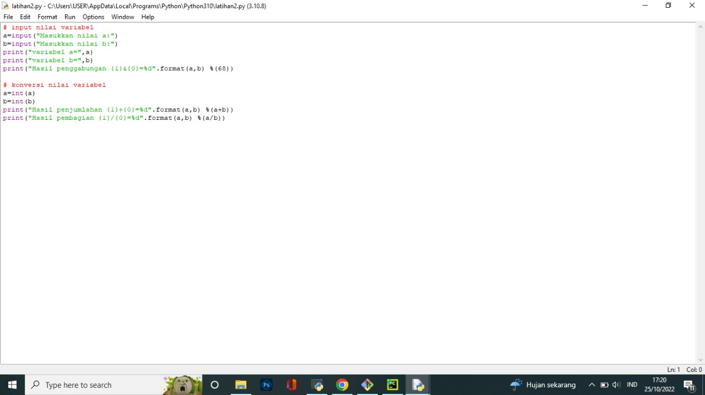
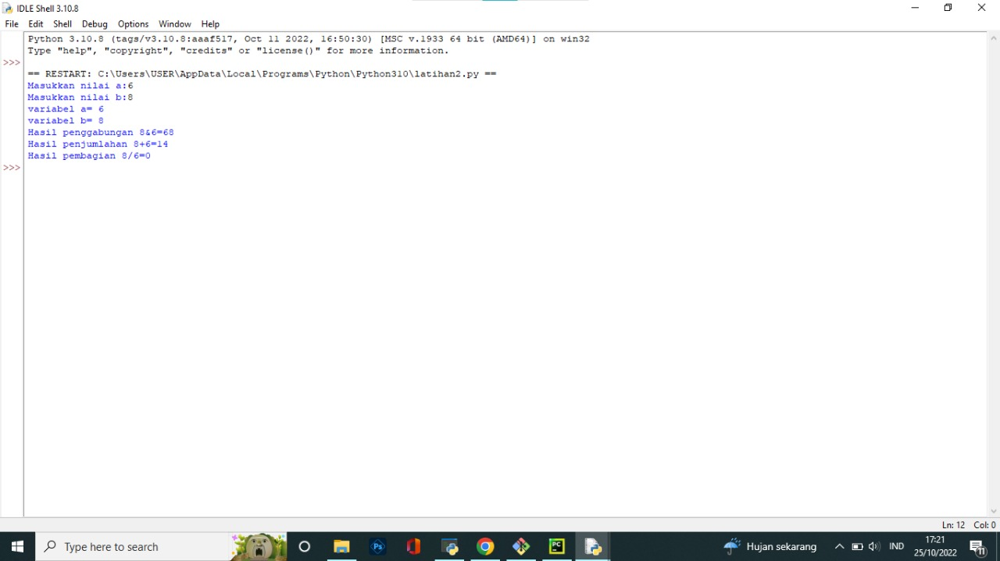
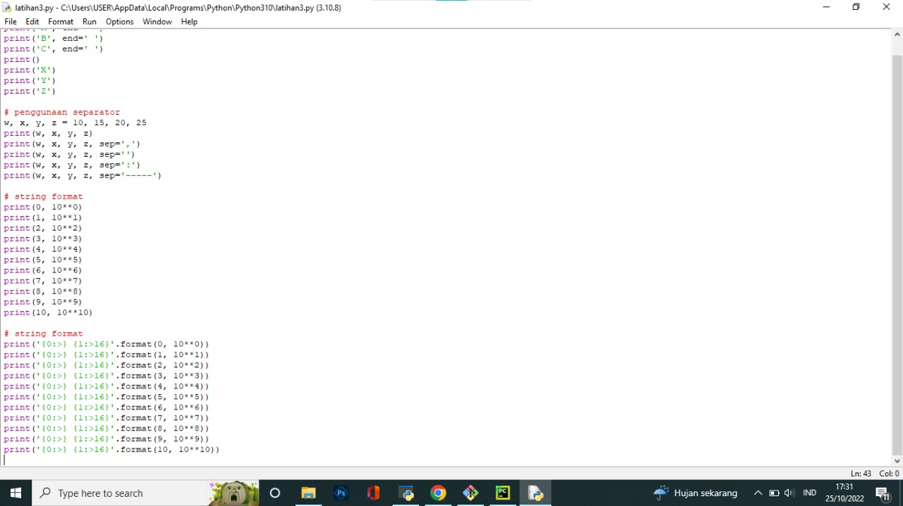
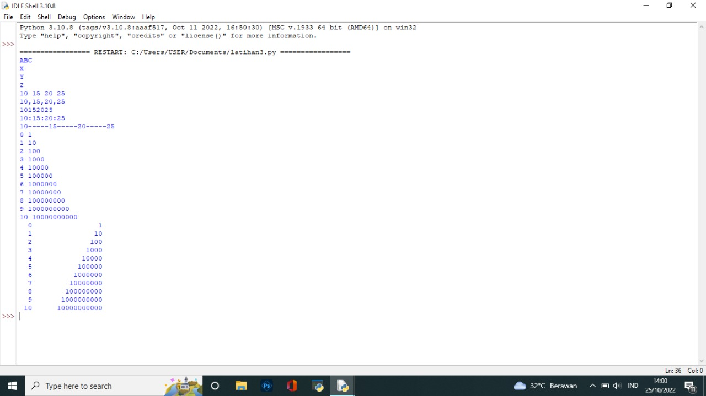
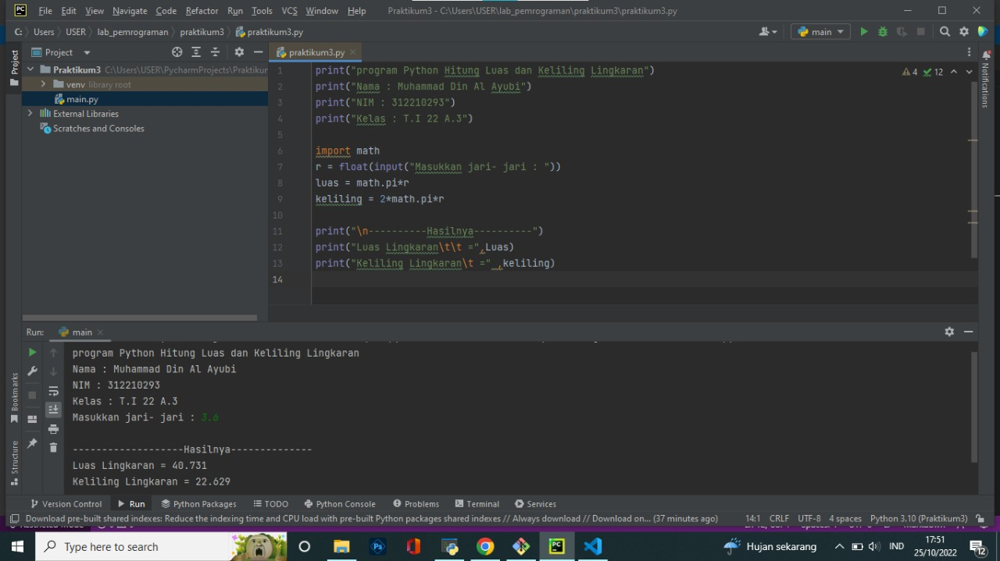

# praktikum3
## tugas praktikum3

## latihan1

## latihan2

## praktikum3
### flowchart

### hasil praktikum

### penjelasan 
program diatas saya mengimport modul math yang sudah di sediakan python. fungsinya supaya dapat menyertakan nilai phi yang sudahtersedia dalam modul tersebut dengan perintah math.pl jika kita coba mencetak fungsi tersebut maka akan menghasilkan nilai 3.14 kita memerlukan nilai jari-jari (r) yang nantinya akan di masukan oleh pengguna pada layar console. kita menggunakan fungsi input() yang nilainya di konversi ke tipe data float (bilangan rill). ingat bahwa fungsi input() akan menganggap semua nilai inputan bertipe string. sehingga kita perlu melakukan konversi ke tipe yang diinginkan.